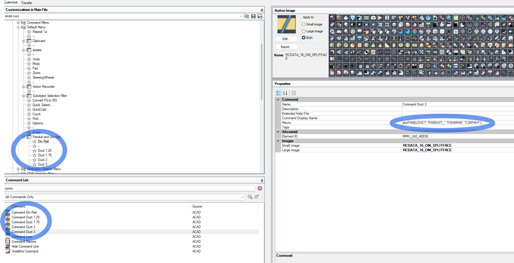
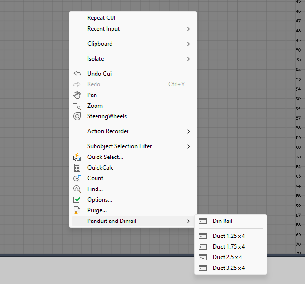

# MyPanelDuct.lsp

This AutoLISP script automates the insertion of DIN rails in AutoCAD Electrical using user-defined presets.

## Features

- Prompts for base and second points to define rail position and orientation
- Allows manual entry of rail length
- Automatically determines horizontal or vertical orientation
- Cleans up temporary drawing aids
- Sets rail attributes and updates descriptions

## Install

- Locate your wd_ptag_addattr_comp.dwg
    - Copy the DESC1 attribute and paste a new Copy
    - Rename this attribute DESC2 for the second line of text to display on the componet
- Locate your wddinrl.xls file. This fill contains all your different din and wire duct profiles
    - Make note of the values in columns [MFG, CAT, ASSYCODE] 
        *Be sure there are values in each column for each part. Us NA if empty. In early testing I had to send a value. Using "" did not work
- Install lisp
    - Run Command APPLOAD
    - In popup under Startup Suite select [Contents]
    - In Startup Suite browse to file and add MyPanelDuct.lsp to the list
    - Restart Acade and the new function should be active
- Create short cuts to use this new tool
    - run command CUI
    - Locatcate the Shortcut Menu you wish to add these fuction to. I suggest selecting the [Default Menu] under the [acad.cuix]
    - In the Command List box search for com to reduce the list length
    - right click in an open space and create n# of new commands
    - Name Each Command and add the following. With parentesies and quotations, Optional Add a button image
    - (myPANELDUCT "MFG" "CAT" "ASSYCODE") 
    - Drag Each New command to the Shortcut Menu you are modifing
    

- Now you should be able to click anywhare on your sheet and add the componet. 

## Usage

1. Load `MyPanelDuct.lsp` in AutoCAD.
2. Run the `MyPanelDuct` command.
3. Follow the prompts to specify points and options.

## Author

Corey Applegate  
Based on work by Arshdeep Singh

## Version

1.0 – May 30, 2025
